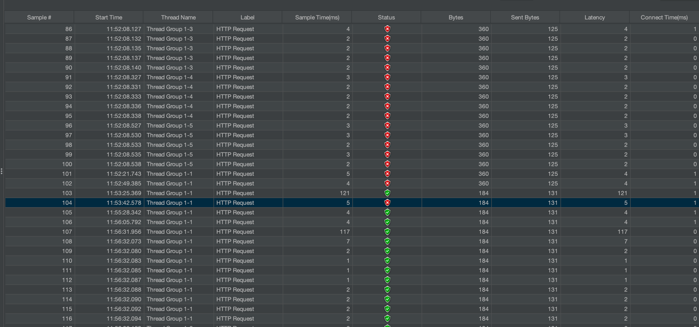

# 부하 테스트 샘플

- 목표 : 부하 테스트와 관련된 내용들을 정리하고 테스트 할 수 있는 환경의 표본을 만들어 놓고 활용하자.

# 부하 테스트(Load Testing)

부하 테스트는 웹 또는 시스템의 성능 확인을 위해 병목 현상과 문제를 발견하는 데 사용되는 일종의 비 기능적 테스트이다.

부하 테스트 시 고려해야할 중요한 정보는 `응답 시간, 지연 시간, 초당 적중, 초당 오류 및 응답 코드`이다.

# 부하 테스트 툴

부하 테스트 툴로는 Apache JMeter, Gatling, K6 등이 존재한다.

## Apache JMeter

- 1998년도 출시
- 가장 인기가 많은 부하 테스트 도구 중 하나.
- 거대한 커뮤니티 보유
- 유지 관리가 잘 되고 있음
- Java 언어 사용
- 구조화 된 프레임워크
    - 컨트롤러, 샘플러, 쓰레드 그룹, ...
    - 구성 요소가 예측 가능한 방식으로 동작할 것을 보장함 (코드 기반인 다른 프레임워크의 경우 보장하기 어렵지만 유연성이 높음. 그만큼 학습이 필요하긴 함)
- Plugin Manager, JMeterPlugins.org 를 통한 활발한 플러그인 지원
- Swing으로 제작한 GUI와 CLI 지원
- Apache 2.0 라이선스 사용

## Gatling

- 12년도 출시
- 초당 수천 개의 요청을 시뮬레이션하고 응답 시간 분포 및 기타 성능 지표의 백분위 수를 포함한 완전한 보고서를 만든다.
- Scala, Akka 및 Netty 기반
- 트래픽 기록을 위한 GUI 제공
- Apache 2.0 라이선스 사용()

## K6

- 17년 GitHub 에서 출시
- 거대 커뮤니티
- Golang(goja : Golang 기반의 오픈 소스 프로젝트, JavaScript 인터프리터), Javascript 사용
- 스크립트 기반 API
- 네이티브로 많은 기능이 지원되어 플러그인이 굳이 필요하지 않음
- 분산 된 부하테스트를 가지고 있지 않음 -> 쿠버네티스를 통한 컨테이너화 배포 시 복잡한 설정 필요
- K6 확장하기 위해 유료 서비스인 K6 Cloud 사용(설정 시간, 복잡성 줄여줌)
- 오픈 소스는 맞으나 `AGPL` 사용
    - copyleft 원칙을 따름(원본 소스의 저작권을 유지 해야함) -> 자유롭게 사용은 가능하지만 반드시 공유해야 함(공개성과 공유 보장)
    - 파생작업(수정, 종속성 등)이 AGPL의 지배를 받음 -> 상업화 하고자 할 때 문제가 있음

## Bees with Machine Guns

- 부하 테스트 시 AWS EC2 인스턴스 사용
- 거대 커뮤니티
- 파이썬 사용
- JMiter, Gatling에 비해 사용하기 어려움

## Artillery

- 최신 부하 테스트
- 로컬 머신 또는 VM에서 몇 분 만에 시작 및 테스트 가능
- Javascript 로 작성, NodeJS 엔진 사용
- npm을 통해 설치가능
- GUI가 없으며, 간단한 CLI가 존재

툴에 대한 비교는 ... 여기까지 하고 직접 실행해보면서 경험해보자. (백날 비교해 봤자 와닿지 않음)

# JMeter

- 선정 기준
    - 사용성 O
    - 대중성 O
    - 유연성 X (기본 기능들 부터 사용해보자)

위 기준을 고려했을 때 JMeter가 그나마 사용성과 대중성이 좋은 것 같다. UI가 안이쁘다는 의견들이 있지만 한 번 경험해보자.

## 설치

https://jmeter.apache.org/download_jmeter.cgi

zip 파일 설치

zip 해제 후 해당 폴더 내 bin의 jmeter 실행하면 GUI 뜸

## 용어

- Thread Group : 테스트에 사용될 쓰레드 개수, 쓰레드 1개당 사용자 1명
- Sampler : 사용자의 액션 (예: 로그인, 게시물 작성, 게시물 조회 등)
- Listener : 응답을 받아 리포팅, 검증, 그래프 등 다양한 처리
- Configuration : Sampler 또는 Listener가 사용할 설정 값 (쿠키, JDBC 커넥션 등)
- Assertion : 응답 확인 방법 (응답 코드, 본문 내용 비교 등)

### Thread Group

- Number of Threads : 쓰레드 개수
- Ramp-up period : 쓰레드 개수를 만드는데 소요되는 시간
- Loop Count : infinite | n 으로 값을 설정할 수 있으며 설정된 값에 따라 Number of Threads X Ramp-up period 만큼 요청을 다시 보낸다.

### Sampler

- Server Name or IP : localhost
- Port Number : 8080
- HTTP Request : {HttpMethod} {url} (ex. GET /test)

### Listener

- 기본 반찬 : View Results Tree, Summary Report, View Results in Table, Aggregate Report
- **View Results Tree**
    - Request, Response data 탭을 통해 요청/응답 확인 가능

- **View Results in Table**

- **Summary Report**
    - Label : Sampler 명
    - \# Samples : 샘플 실행 수 (Number of Threads X Ramp-up period)
    - Average : 평균 걸린 시간 (ms)
    - Min : 최소
    - Max : 최대
    - Std. Dev. : 표준편차
    - Error % : 에러율
    - Throughput : 분당 처리량
    - Received KB/sec : 초당 받은 데이터량
    - Sent KB/sec : 초당 보낸 데이터량
    - Avg. Bytes : 서버로부터 받은 데이터 평균
- **Aggregate Report**
    - Label : Sampler 명
    - \# Samples : 샘플 수 (Number of Threads X Ramp-up period)
    - Average : 평균 응답 시간
    - Median : 응답 시간 중앙값
    - 90% Line : 90%의 샘플은 해당 값보다 적은 시간 내에 끝나고 10%는 더 걸린다. 라는 뜻의 컬럼
    - 95% Line : 95%의 샘플은 해당 값보다 적은 시간 내에 끝나고 5%는 더 걸린다. 라는 뜻의 컬럼
    - 99% Line : 99%의 샘플은 해당 값보다 적은 시간 내에 끝나고 1%는 더 걸린다. 라는 뜻의 컬럼
    - Min : 최소값
    - Maximum : 최대값
    - Error % : 에러율
    - Throughput : 초당 처리량
    - Received KB/sec : 초당 받은 KB
    - Sent KB/sec : 초당 보낸 KB

### Assertion

- Response Assertion : 응답값 확인

### Plugin

- BlazeMeter : 크롬 확장 프로그램. 행동을 녹화해 JMeter에서 사용하는 .jmx 파일로 만들어 사용 가능

## 주의사항

테스트 대상인 웹 어플리케이션과 테스트를 돌리는 서버가 서로 다른 곳에 있어야 정확한 테스트가 가능하다.(같은 서버내에서 테스트 시 자원을 같이 사용)

## 사용 후기

- GUI 제공과 쉬운 사용방법으로 사용성이 너무 좋았음
- 대중적인 툴인 만큼 참고할 내용도 많음

# 참고

- [상위 부하 테스트 도구 (오픈 소스 목록)](https://loadfocus.com/ko-kr/load-testing-tools-open-source#beeswithmachineguns)
- [[Spring] JMeter 사용법 - JMeter란?, 테스트 방법](https://effortguy.tistory.com/164)